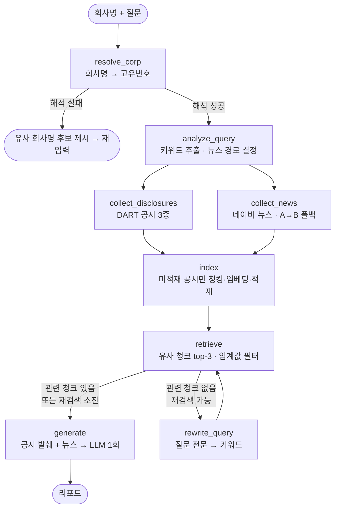

# ComIn — Company Information RAG Agent

회사명과 질문을 입력하면 **DART 공시**와 **네이버 뉴스**를 근거로 짧은 기업 리서치 리포트를 생성하는 RAG 파이프라인입니다.

> 예: `삼성전자` + `주요 사업 리스크가 뭐야?` -> 공식 공시 발췌와 최근 뉴스를 근거로 답변 + 근거 출처 표기

이 프로젝트는 **RAG를 세 단계로 직접 구현·발전시키며 학습**하는 것을 목표로 합니다.

| 단계                        | 내용                                        | 상태                          |
| ------------------------- | ----------------------------------------- | --------------------------- |
| **Phase 1 - Vanilla RAG** | LangChain 없이 청킹·임베딩·검색·생성을 직접 구현          | ✅ 완료 (`vanilla_rag/`)       |
| **Phase 2 - LangChain**   | 직접 구현한 부품을 LangChain 표준 컴포넌트로 교체          | ✅ 완료 (`langchain_rag/`)     |
| **Phase 3 - LangGraph**   | 조건 분기·병렬 수집·상한 제어를 그래프 구조로 드러내기           | 🚧 진행 중 (`langgraph_rag/`)  |

동일한 파이프라인을 세 방식으로 나란히 구현해, **"직접 구현 vs 프레임워크 vs 그래프 오케스트레이션"을 1:1로 비교**할 수 있습니다.

Phase 3는 두 번의 이터레이션으로 진행 중입니다.
- **1차 (완료)** — Phase 2와 같은 선형 흐름을 그대로 그래프로 이관 + 예산 가드를 상태 기반으로 재설계.
- **2차 (완료)** — 회사명 퍼지 매칭, 뉴스 A+B 하이브리드 쿼리, 저품질 검색 분기·재검색, 공시/뉴스 병렬 수집.

---

## 동작 흐름 (Phase 3)

Phase 1·2는 아래를 **선형**으로 실행하고, Phase 3는 같은 단계를 **조건 분기·병렬·재검색 루프**가 있는 그래프로 실행합니다.



- **회사명 해석** — 완전일치 → 공백·법인 표기 정규화 재시도 → 실패 시 rapidfuzz로 비슷한 이름 후보 제시 (자동 선택하지 않음).
- **수집 공시** — 최신 사업보고서 1 + 정기보고서(분기/반기) 1 + 주요사항보고서 1 (있을 때). 이미 적재된 공시는 `rcept_no`로 확인해 **재임베딩을 생략**.
- **뉴스** — 질문에서 뽑은 키워드로 검색(A), 결과가 없으면 회사명만 최신순으로 폴백(B). 최근 90일 이내.
- **검색 재질의** — 질문 전문 검색이 임계값 미달이면 키워드 쿼리로 **1회 재검색**, 그래도 없으면 뉴스만으로 리포트 생성. (재검색 상한 2회)
- **유료 호출** — 리포트 생성 LLM만 유료이며, **그래프 실행당 1회**로 제한.

---

## 프로젝트 구조

```
comin_project/
├── data/                       # 데이터 수집 계층 (Phase 무관 공통)
│   ├── config.py               # API 키 로드, HTTP 캐시 세션(12h)
│   ├── corp_code.py            # 회사명 ↔ 고유번호 매핑(sqlite) + 정규화·퍼지매칭
│   ├── collect_data.py         # DART 공시 목록 + 네이버 뉴스 수집
│   ├── dart_origin_document.py # 공시 원문 zip → 서술형 본문 텍스트(표 제외)
│   ├── chunking.py             # 직접 구현한 문단 기준 청킹 (Phase 1)
│   └── embedding.py            # SentenceTransformer·Chroma 직접 조작 (Phase 1)
│
├── vanilla_rag/                # Phase 1 - 직접 구현
│   ├── generate.py             # 프롬프트 조립 + Anthropic SDK 직접 호출
│   └── rag.py                  # 파이프라인 엔트리포인트
│
├── langchain_rag/              # Phase 2 - LangChain 컴포넌트
│   ├── vectorstore.py          # HuggingFaceEmbeddings + Chroma + TextSplitter
│   ├── chain.py                # ChatPromptTemplate + ChatAnthropic + LCEL
│   └── rag.py                  # 파이프라인 엔트리포인트
│
├── langgraph_rag/              # Phase 3 - LangGraph 오케스트레이션
│   ├── state.py                # 그래프 공유 상태(ResearchState) 스키마
│   ├── nodes.py                # resolve/analyze/collect/index/retrieve/rewrite/generate 노드
│   ├── graph.py                # 노드 배선 + 조건부 라우팅 함수
│   ├── query_analysis.py       # 룰 기반 키워드 추출
│   └── rag.py                  # 파이프라인 엔트리포인트
│
├── tests/
│   └── test_smoke.py           # 유료 API 없이 배관·분기 검증하는 스모크 테스트
│
└── docs/
    └── DEVLOG.md               # 개발 로그 (진행 상황·설계 결정)
```

---

## 단계별 컴포넌트 매핑

**Phase 1 → 2**: 동작은 그대로 두고 직접 구현 부품을 LangChain 표준 컴포넌트로 교체.

| 역할      | Vanilla (직접 구현)                         | LangChain                                   |
| ------- | --------------------------------------- | ------------------------------------------- |
| 청킹      | `chunking.py`의 `chunk_text()`           | `RecursiveCharacterTextSplitter`            |
| 임베딩     | `SentenceTransformer.encode()`          | `HuggingFaceEmbeddings`                     |
| 벡터 스토어  | `chromadb.PersistentClient` 직접 조작       | `langchain_chroma.Chroma`                   |
| 검색      | `collection.query()` + 수동 유사도 계산        | `similarity_search_with_relevance_scores()` |
| 프롬프트    | f-string 문자열 조립                         | `ChatPromptTemplate`                        |
| LLM 호출  | `anthropic.Anthropic().messages.create` | `ChatAnthropic`                             |
| 오케스트레이션 | 수동 함수 호출                                | LCEL 파이프 (`prompt \| llm \| parser`)        |

**Phase 2 → 3**: 컴포넌트는 그대로 재사용하고 **오케스트레이션(호출 순서)만** 그래프로 교체.

| 역할          | LangChain               | LangGraph                          |
| ----------- | ----------------------- | ---------------------------------- |
| 파이프라인 정의    | `main()`의 함수 호출 순서       | `StateGraph` 노드/엣지 선언              |
| 중간 결과 전달    | `main()`의 지역 변수          | `ResearchState` (명시적 상태 스키마)       |
| 조건 분기       | 없음 (선형)                 | 라우팅 함수 + `add_conditional_edges`    |
| 예산 가드       | 모듈 전역 카운터               | 상태 필드 `paid_call_count` (실행당 초기화)   |

> ⚠️ Phase 2에서 임베딩 모델을 KURE-v1로 교체하며 vanilla와 컬렉션이 갈라졌습니다. Phase 1(`disclosures`, ko-sroberta 768차원)과 Phase 2·3(`disclosures_kure_v1`, KURE 1024차원)은 **별도 컬렉션**을 사용합니다.

---

## 설치 및 실행

### 요구 사항

- Python >= 3.11
- [uv](https://docs.astral.sh/uv/)
- API 키: [OpenDART](https://opendart.fss.or.kr/), [네이버 API HUB](https://www.ncloud.com/product/applicationService/naverApiHub), [Anthropic](https://console.anthropic.com/)

### 1. 설치

```bash
git clone <repo>
cd comin_project
uv sync
```

### 2. API 키 설정

`.env.example`을 복사해 `.env`를 만들고 키를 채웁니다.

```bash
cp .env.example .env
```

```env
DART_API_KEY=...
NAVER_CLIENT_ID=...
NAVER_CLIENT_SECRET=...
ANTHROPIC_API_KEY=...
```

### 3. 회사명 매핑 테이블 구축 (최초 1회)

DART에서 전체 회사 고유번호를 받아 로컬 sqlite 테이블을 만듭니다.

```bash
uv run python -c "from data.corp_code import build_corp_code_db; build_corp_code_db()"
```

### 4. 실행

```bash
# Phase 1 - Vanilla RAG
uv run python -m vanilla_rag.rag

# Phase 2 - LangChain RAG
uv run python -m langchain_rag.rag

# Phase 3 - LangGraph RAG
uv run python -m langgraph_rag.rag
```

실행하면 회사명과 질문을 입력받아 리포트를 출력합니다.

### 테스트

유료 API·네트워크·임베딩 모델 로드 없이 파이프라인 배관과 분기를 검증합니다.

```bash
uv run pytest
```

---

## 실행 예시

`삼성전자` + `반도체 위험요소`로 실행한 실제 출력입니다. 리포트는 **공식 공시(내재적 위험)** 와 **뉴스(외재적 위험)** 를 구분하고, 문장마다 근거 번호(`발췌 N`, `뉴스 N`)를 표기하며, 자료로 단정할 수 없는 부분은 "주어진 자료로는 확인할 수 없음"으로 명시합니다.

<details>
<summary><b>삼성전자 · "반도체 위험요소" 리포트 전문</b> (클릭해서 펼치기)</summary>

```text
회사명: 삼성전자
질문: 반도체 위험요소

## 답변: 삼성전자의 반도체 관련 주요 위험 요인

삼성전자의 반도체 사업(DS 부문)은 ①산업 구조적 위험(경기변동성·경쟁구조)과 ②외부 지정학적 리스크로 인한 주가 급변동 위험이 동시에 존재하는 것으로 확인됨.

### 1. 산업 구조적 위험
- DS 부문은 메모리 반도체(DRAM, NAND), System LSI(모바일AP, 카메라센서), Foundry(위탁생산) 등으로 구성되어 있으며, 특히 Foundry 시장은 대규모 Capa를 보유한 5개 내외 소수 업체가 과점하는 구조로 경쟁이 치열함(발췌 2, 발췌 3).
- 메모리 반도체는 데이터센터의 AI 인프라 투자 확대에 힘입어 최근 수요 강세를 보이고 있으나, 이는 반대로 AI 투자 사이클 둔화 시 수요 급감 리스크로 이어질 수 있는 구조임(발췌 3).
- System LSI는 모바일용에서 차량용으로 응용처 확장을 추진 중이나 아직 시장 지배력 확대 단계로, 신규 응용처 안착 여부가 불확실함(발췌 2).

### 2. 지정학적 리스크로 인한 주가·수급 급변동 위험
- 2026년 7월 미국의 이란 추가 공습 및 호르무즈 해협 봉쇄 이슈로 위험자산 회피 심리가 확산되며 삼성전자 및 SK하이닉스 등 반도체주가 동반 급락함(뉴스 2, 뉴스 7).
- 실제로 삼성전자 주가는 하루 만에 10.70% 급락(25만4,500원 마감)하였고, 코스피 전체도 8.95% 급락해 서킷브레이커가 발동되는 등 반도체 비중이 높은 국내 증시 전반에 충격이 확산됨(뉴스 3, 뉴스 7, 뉴스 9).
- 이러한 변동성은 반도체 산업 자체의 펀더멘털보다 중동發 지정학적 리스크와 유가 상승 등 외부 요인에 기인한 것으로 분석됨(뉴스 3).

### 3. 밸류에이션·투자심리 위험
- 최근 아시아 반도체주의 급등세에 대해 일부 글로벌 운용사(예: 애버딘)는 "상승세가 과도하다"고 판단, 베팅을 축소하는 등 밸류에이션 부담에 대한 우려가 제기됨(뉴스 4).
- 급격한 주가 변동은 삼성전자 등에 2배로 베팅하는 레버리지 ETF의 "음의 복리 효과"를 심화시켜 개인투자자 손실을 확대시켰고, 이에 금융당국이 투자자 보호 대책 마련에 나서는 등 시장 구조적 리스크로 확산되는 모습이 관찰됨(뉴스 5, 뉴스 6).

### 4. 정책적 위험
- 정부 차원에서도 차세대 반도체 관련 규제개선의 필요성이 논의되고 있어, 향후 정책 방향에 따라 투자 및 사업 환경이 영향을 받을 가능성이 있음(뉴스 1).

종합: 삼성전자의 반도체 위험은 산업 자체의 경쟁구조·경기변동성이라는 내재적 위험(발췌 1·2·3)과, 2026년 7월 중동 지정학적 리스크로 촉발된 단기 주가 급락 및 투자심리 위축이라는 외재적 위험(뉴스 2·3·4·5·6·7·9)이 복합적으로 작용하고 있음. 다만 이러한 급락이 반도체 산업 펀더멘털 자체의 훼손을 의미하는지는 주어진 자료로는 확인할 수 없음.
```

</details>

---

## 주요 설계 결정

- **예산 방어** - 유일한 유료 API(Claude)는 **실행당 1회만** 호출합니다. Phase 3에서는 이 카운터를 그래프 상태(`paid_call_count`)로 옮겨, 멀티턴에서도 실행마다 0에서 시작하도록 재설계했습니다. 검증은 임베딩·검색 등 무료 구간에서 끝냅니다.
- **HTTP 캐싱** - DART·네이버 응답을 12시간 캐싱(`requests-cache`)해 무료 API 호출도 아낍니다.
- **공시 중복 적재 방지** - `rcept_no`로 이미 적재된 공시는 건너뜁니다.
- **표 제외 파싱** - 공시 원문에서 표(TABLE)를 통째로 제외하고 서술형 태그(P/TITLE)만 추출합니다. 표를 평면화하면 숫자가 맥락 없이 나열되어 검색 품질을 해치기 때문입니다.
- **임베딩 일관성** - 문서 적재와 질의 검색에 반드시 같은 임베딩 모델(현재 `nlpai-lab/KURE-v1`)을 써 임베딩 공간을 일치시킵니다. 정규화(L2) + cosine을 전제로 학습된 모델이라 그대로 따릅니다.
- **회사명 퍼지 매칭** - 완전일치가 실패해도 공백·법인 표기를 정규화해 재시도하고, 그래도 없으면 비슷한 이름 후보를 제시합니다. 다른 회사를 조용히 고르면 리서치 전체가 엉뚱해지므로 **자동 선택은 하지 않습니다**.
- **저품질 검색 분기** - Phase 1·2는 임계값 미달이어도 top-1을 남겼지만, 무관한 청크가 컨텍스트에 섞여 환각을 유발했습니다. Phase 3는 이 fallback을 없애고 **키워드 재검색 → 뉴스만 생성**으로 분기합니다.

---

## 한계 및 개선 예정

**Phase 3에서 해결됨**
- ~~회사명 불일치~~ → 정규화 + 퍼지 매칭 후보 제시로 해결.
- ~~뉴스 쿼리 빈약~~ → 키워드 추출 기반 A+B 하이브리드로 개선 (질문 전문 검색 대비 결과 대폭 증가).

**남은 과제**
- **표 데이터 손실** - 현재 표를 제외하므로 재무·실적 수치가 빠집니다. DART 정형 API로 별도 수집하는 방향을 검토 중입니다.
- **임계값 재보정** - `RELEVANCE_THRESHOLD=0.3`이 top-1 fallback 제거 후 "생성이냐 재검색이냐"의 분기 기준이 되어 중요도가 커졌습니다. KURE 점수 분포 데이터가 쌓이면 재보정할 예정입니다.
- **키워드 추출** - 현재 룰 기반(불용어·조사 제거)이라 형태소 분석기 수준의 정밀도는 없습니다. 한계가 확인되면 로컬 모델로 교체를 검토합니다.
- **멀티턴 예산 상한** - 유료 호출은 실행당 1회로 막지만, 세션 누적 상한은 미정입니다.
- **채용공고 데이터** - 취준생 관점의 차별화 기능으로 회사 채용 공고·기술 동향 수집을 계획 중입니다.
- **평가 체계 부재** - 아직 리포트 품질을 정량 평가하지 않습니다. 평가 지표 도입을 검토 중입니다.
- **CLI 전용** - 현재 커맨드라인 대화형입니다. 임베딩 모델·벡터 스토어를 한 번만 로드해 재사용하는 구조는 이미 잡아두어, FastAPI 서버화로 확장할 수 있습니다.

자세한 개발 과정과 고민은 [docs/DEVLOG.md](docs/DEVLOG.md)를 참고하세요.

---

## 데이터 출처

- **[OpenDART](https://opendart.fss.or.kr/)** - 금융감독원 전자공시. 회사 고유번호, 공시 목록, 공시 원문.
- **[네이버 검색 API](https://www.ncloud.com/product/applicationService/naverApiHub)** - 최근 뉴스 제목·요약·링크.

두 API 모두 발급받은 개인 키로 호출하며, 응답은 로컬에만 캐싱합니다. 원문·기사 저작권은 각 제공처에 있습니다.

---

## 기술 스택

- **언어/도구**: Python 3.11+, uv, pytest
- **데이터**: OpenDART API, 네이버 검색 API, sqlite, rapidfuzz(퍼지 매칭)
- **RAG**: LangChain (core / anthropic / chroma / huggingface / text-splitters), LangGraph, ChromaDB
- **임베딩**: `nlpai-lab/KURE-v1` (한국어 검색 특화, bge-m3 기반, 1024차원 / 8192토큰) · Phase 1은 `jhgan/ko-sroberta-multitask`(768차원) 유지
- **LLM**: Claude (`claude-sonnet-5`)
