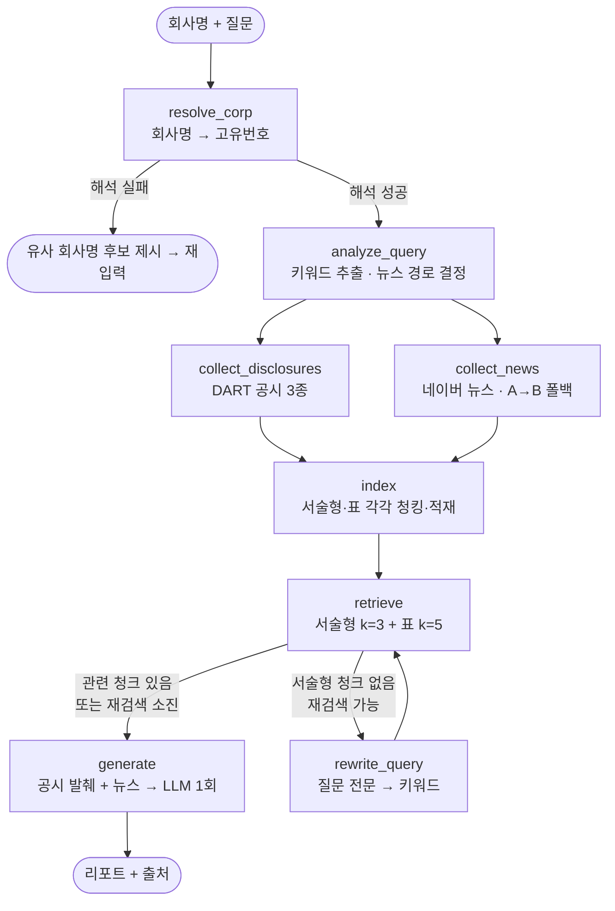

# ComIn (Company Information RAG Agent)


**회사명과 질문을 입력하면 DART 공시와 네이버 뉴스를 근거로 기업 리서치 리포트를 생성하고, 이를 기반으로 대화를 이어나갑니다.**

---

## 만들게 된 이유

기업을 조사할 때 정보가 두 곳에 나뉘어 있습니다.

- **공시**는 정확하지만 수백 페이지고, 원하는 수치가 어디 있는지 찾기 어렵습니다.
- **뉴스**는 최신이지만 해석과 추측이 섞여 있습니다.

챗봇에 물으면 둘을 뭉뚱그려 그럴듯한 답을 주는데, **어디서 가져온 정보인지 알 수 없어 그대로 쓸 수 없습니다.**

ComIn은 공시와 뉴스를 구분해서 컨텍스트에 넣고, 문장마다 `(발췌 3)` `(뉴스 7)`로 출처를 표기하며, 근거가 없으면 *"주어진 자료로는 확인할 수 없음"* 이라고 밝힙니다. **답을 못 하는 것보다 지어내는 게 더 나쁘다**는 전제로 만들었습니다.

**주 사용자**는 지원할 회사를 조사하는 취업 준비생입니다.(기능 추가 예정)

---

## 특징

```
질문: 삼성전자 주요 사업 리스크가 뭐야?
```

|       | ComIn                     |
| ----- | ------------------------- |
| 근거    | 문장마다 `(발췌 3)`·`(뉴스 7)`    |
| 자료 구분 | **공시**(공식)와 **뉴스**(참고) 분리 |
| 모르는 것 | "주어진 자료로는 확인할 수 없음"       |
| 출처 링크 | 원본 메타데이터로 **코드가 렌더링**     |

LLM에게 링크를 쓰게 하면 잘못될 수 있어서 **인용 표기를 코드가 역참조해** 실제 보고서명·URL을 붙입니다.

---

## 구현 단계

RAG를 **세 방식으로 나란히 구현**해 "직접 구현 vs 프레임워크 vs 그래프 오케스트레이션"을 1:1로 비교할 수 있게 했습니다.

| 단계                      | 내용                              | 상태                      |
| ----------------------- | ------------------------------- | ----------------------- |
| **Phase 1 · Vanilla**   | LangChain 없이 청킹·임베딩·검색·생성 직접 구현 | ✅ `vanilla_rag/`        |
| **Phase 2 · LangChain** | 직접 구현 부품을 표준 컴포넌트로 교체           | ✅ `langchain_rag/`      |
| **Phase 3 · LangGraph** | 조건 분기·병렬 수집·재검색 루프를 그래프로        | ✅ `langgraph_rag/`      |
| **Phase 4 · 평가 · 개선**   | 지표 파이프라인 구축 후 개선을 수치로 검증        | 🚧 진행 중 (`evaluation/`) |

---

## 동작 흐름



```mermaid
flowchart TD
    START([회사명 + 질문]) --> resolve[resolve_corp<br/>회사명 → 고유번호]
    resolve -->|해석 실패| cand([유사 회사명 후보 제시 → 재입력])
    resolve -->|해석 성공| analyze[analyze_query<br/>키워드 추출 · 뉴스 경로 결정]

    analyze --> disc[collect_disclosures<br/>DART 공시 3종]
    analyze --> news[collect_news<br/>네이버 뉴스 · A→B 폴백]
    disc --> index[index<br/>서술형·표 각각 청킹·적재]
    news --> index

    index --> retrieve[retrieve<br/>서술형 k=3 + 표 k=5]
    retrieve -->|관련 청크 있음<br/>또는 재검색 소진| generate[generate<br/>공시 발췌 + 뉴스 → LLM 1회]
    retrieve -->|서술형 청크 없음<br/>재검색 가능| rewrite[rewrite_query<br/>질문 전문 → 키워드]
    rewrite --> retrieve
    generate --> OUT([리포트 + 출처])
```

- **회사명 해석** - 완전일치 -> 공백·법인 표기 정규화 재시도 -> 실패 시 rapidfuzz로 후보 제시.
- **수집 공시** - 최신 사업보고서 + 정기보고서 + 주요사항보고서. 이미 적재된 공시는 `rcept_no`로 확인해 재임베딩을 생략합니다.
- **뉴스** - 질문 키워드로 검색(A), 결과가 없으면 회사명만 최신순으로 폴백(B). 최근 180일 이내만 사용.
- **검색** - 서술형과 표를 **별도 컬렉션**에서 검색합니다.
- **재질의** - 서술형 검색이 임계값 미달이면 키워드 쿼리로 1회 재검색, 그래도 없으면 뉴스만으로 생성.
- **유료 호출** - **그래프 실행당 1회**로 제한합니다.(추후 기능 추가가 되면 상한을 늘릴 예정)

---

## 실행 예시

`삼성전자` + `주요 사업 리스크가 뭐야?`의 실제 출력입니다. 리포트는 `결론 -> 근거 -> 한계/유의점` 세 섹션이 프롬프트로 강제되고, **출처 섹션은 LLM이 아니라 코드가** 인용 표기를 역참조해 붙입니다.

<details>
<summary><b>리포트 전문</b> (클릭해서 펼치기)</summary>

```markdown
## 결론
삼성전자의 주요 사업 리스크는 크게 금융·재무 리스크(유동성·환율·이자율·지분가격·신용위험)와
사업 운영상의 리스크(메모리 업황 변동성, 노조 파업에 따른 생산 차질, 신규 로보틱스 사업의 기술
리스크, 반도체 사업장의 자연자본 리스크)로 구분된다(발췌 1, 발췌 4, 발췌 8, 뉴스 4, 뉴스 10).

## 근거
공시 기준으로 삼성전자는 대규모 투자가 필요한 사업 특성상 유동성위험 관리를 핵심 재무 리스크로
명시하고 있으며, 이를 위해 권역별 Cash Pooling 시스템을 운영해 자금 부족·잉여 법인 간 유동성을
통합관리하고 있다(발췌 1, 발췌 2, 발췌 3). 또한 글로벌 영업활동에 따라 USD, EUR 등 주요 통화의
환율변동위험, 예금·변동금리부 차입금에서 비롯되는 이자율변동위험, 전략적 투자 목적의 지분상품
보유에 따른 지분가격위험, 거래상대방의 계약불이행에 따른 신용위험이 재무위험관리 대상으로
공시되어 있다(발췌 8, 발췌 4, 발췌 5).

사업 측면에서는 메모리 반도체의 고질적인 업황 순환(사이클) 리스크가 존재하며, 이를 완화하기 위해
eSSD 등 낸드 사업에서 주요 고객사와 다년간 장기 공급계약을 체결해 수급 변동성을 줄이려는 전략을
취하고 있다(뉴스 1). 신규 성장동력으로 추진 중인 로보틱스 사업은 기대감을 높이고 있으나 기술적
리스크가 여전히 상존한다고 평가된다(뉴스 3).

ESG·환경 측면에서는 반도체(DS) 사업장이 수자원 공급, 수질오염, 대기오염, 폐기물, 자연재해 등
5개 자연자본 리스크를 핵심 리스크로 식별하였으며, 특히 대규모 용수를 사용하는 반도체 공정 특성상
'물'과 관련된 리스크가 핵심으로 지목되고 있다(뉴스 10).

## 한계/유의점
제공된 공시 발췌는 재무위험관리 항목 위주로 구성되어 있어, 사업보고서 내 별도의 "사업의 위험"
서술 원문은 확인되지 않는다. 메모리 업황, 로보틱스 기술, 파업, 자연자본 리스크 등은 뉴스 보도에
기반한 것으로 언론의 해석과 평가가 일부 포함되어 있다. 따라서 뉴스에서 언급된 리스크들의
공식적·구체적 내용은 주어진 자료만으로는 확인할 수 없음.

## 출처
- 공시: 사업보고서 (2025.12) (접수번호 20260310002820)
- 공시: 분기보고서 (2026.03) (접수번호 20260515002181)
- 뉴스 1: "불황 오면 어쩌지?"…삼성·SK, 장기계약으로 메모리 사이클 깬다 - https://n.news.naver.com/...
- 뉴스 3: [특징주] 삼성전자 로봇사업 강화에 두산로보틱스 10%↑⋯두산도 급등 - https://www.etoday.co.kr/...
- 뉴스 10: 삼성전자, 반도체 자연자본 리스크 5개로 압축…핵심은 결국 '물' - http://www.impacton.net/...
```

</details>

---

## 평가

고정 질문셋 25개와 저장해놓은 데이터로 파이프라인을 실행하고, 개선마다 3패스를 돌려 **노이즈 폭이 겹치는지** 측정해서 개선 여부를 판정합니다. LLM 출력은 결정론적이지 않아 단일 실행 차이는 근거가 되지 않기 때문입니다.

### 측정 규칙

| 항목    | 규칙                                                    |
| ----- | ----------------------------------------------------- |
| 패스 수  | **3패스**. min~max가 겹칠 때 이전보다 두 값이 높아졌으면 개선으로 평가합니다     |
| 변경 단위 | **한 번에 하나만.**                                         |
| 결과 보존 | 리포트 전문과 컨텍스트를 저장 -> **지표를 바꾸거나 추가해도 유료 재실행 없이** 소급 계산 |
### 결과

| 지표                                          | v1          | v2          | C1              | C2              |
| ------------------------------------------- | ----------- | ----------- | --------------- | --------------- |
| `citation_coverage` - 근거 표기가 붙은 문장 비율       | 0.457~0.493 | 0.586~0.655 | 0.583~0.680     | **0.701~0.765** |
| `table_evidence_recall` - 표에만 있는 수치의 검색 성공률 | 0.000       | 0.000       | **0.800**       | 0.800           |
| `abstain_accuracy` - 답할 때 답하고 회피할 때 회피      | 0.708~0.792 | 0.667~0.792 | **0.917~0.958** | 0.917~0.958     |
| `citation_validity` - 존재하는 근거 번호만 인용        | 1.000       | 1.000       | 0.994~1.000     | 1.000           |

- **v2**: 리포트 포맷을 `결론/근거/한계`로 강제 -> 근거 표기 비율 상승
- **C1**: 공시 표 파싱 + 서술형/표 컬렉션 분리 -> 표 질문 회피율 **1.000 -> 0.000~0.200**
- **C2**: 발췌에 회사명·보고서명 표기 -> 근거 표기 비율 추가 상승

### LLM-as-judge

정규식 지표는 *"인용이 달려 있는가"* 만 측정합니다. `(발췌 2)`를 아무 데나 붙여도 만점입니다. 그래서 **인용한 근거가 실제로 그 문장을 뒷받침하는지** 를 LLM이 판정하게 했습니다.

`citation_validity`가 1.000인 실행에서도 judge는 주장의 **21%를 "근거로 확인되지 않음"** 으로 판정한 이 간극이 해당 지표의 존재 이유입니다.

judge 자체도 검증했습니다. 주장 30개를 직접 라벨링해 대조한 결과 **일치율 86.7%**(`claude-opus-5` 기준)였습니다.

---

## 프로젝트 구조

```
comin_project/
├── data/                       # 데이터 수집 계층 (Phase 무관 공통)
│   ├── config.py               # API 키 로드, HTTP 세션
│   ├── corp_code.py            # 회사명 <-> 고유번호 매핑(sqlite) + 정규화·퍼지매칭
│   ├── collect_data.py         # DART 공시 목록 + 네이버 뉴스 수집
│   ├── dart_origin_document.py # 공시 원문 → 서술형 + 표(격자 복원 후 행 단위 평문화)
│   ├── chunking.py             # 직접 구현한 문단 기준 청킹 (Phase 1)
│   └── embedding.py            # SentenceTransformer·Chroma 직접 조작 (Phase 1)
│
├── vanilla_rag/                # Phase 1 - 직접 구현
├── langchain_rag/              # Phase 2 - LangChain 
│   ├── vectorstore.py          # 서술형·표 두 컬렉션 + 임베딩 + 검색
│   └── chain.py                # 프롬프트 + 컨텍스트 조립 + 출처 렌더링
│
├── langgraph_rag/              # Phase 3 - LangGraph 
│   ├── state.py                # 그래프 공유 상태(ResearchState) 스키마
│   ├── nodes.py                # 노드
│   ├── graph.py                # 노드 결합 + 조건부 라우팅
│   └── query_analysis.py       # 룰 기반 키워드 추출
│
├── evaluation/                 # 평가 파이프라인
├── api/                        # FastAPI - 동기 + SSE 스트리밍
├── frontend/                   # 프론트엔드 1층 - Streamlit MVP
├── web/                        # 프론트엔드 2층 - Next.js 채팅 UI
├── observability/tracing.py    # LangSmith 추적
└── docs/                       # 개발 로그 · 평가지표 개선과정
```

---

## 단계별 컴포넌트 매핑

**Phase 1 -> 2**: 동작은 그대로 두고 직접 구현 부품을 LangChain 표준 컴포넌트로 교체.

| 역할      | Vanilla (직접 구현)                         | LangChain                                   |
| ------- | --------------------------------------- | ------------------------------------------- |
| 청킹      | `chunking.py`의 `chunk_text()`           | `RecursiveCharacterTextSplitter`            |
| 임베딩     | `SentenceTransformer.encode()`          | `HuggingFaceEmbeddings`                     |
| 벡터 스토어  | `chromadb.PersistentClient` 직접 조작       | `langchain_chroma.Chroma`                   |
| 검색      | `collection.query()` + 수동 유사도 계산        | `similarity_search_with_relevance_scores()` |
| 프롬프트    | f-string 문자열 조립                         | `ChatPromptTemplate`                        |
| LLM 호출  | `anthropic.Anthropic().messages.create` | `ChatOpenAI`                                |
| 오케스트레이션 | 수동 함수 호출                                | LCEL 파이프 (`prompt \| llm \| parser`)        |

**Phase 2 -> 3**: 컴포넌트는 재사용하고 **오케스트레이션만** 그래프로 교체.

| 역할       | LangChain          | LangGraph                         |
| -------- | ------------------ | --------------------------------- |
| 파이프라인 정의 | `main()`의 함수 호출 순서 | `StateGraph` 노드/엣지 선언             |
| 중간 결과 전달 | `main()`의 지역 변수    | `ResearchState` (명시적 상태 스키마)      |
| 조건 분기    | 없음 (선형)            | 라우팅 함수 + `add_conditional_edges`  |
| 예산 가드    | 모듈 전역 카운터          | 상태 필드 `paid_call_count` (실행당 초기화) |
| 멀티턴      | 없음                 | checkpointer + `thread_id`        |

---

## 설치 및 실행

### 요구 사항

- Python >= 3.11, [uv](https://docs.astral.sh/uv/)
- Node.js >= 20 (웹 UI 사용 시)
- API 키: [OpenDART](https://opendart.fss.or.kr/), [네이버 API HUB](https://www.ncloud.com/product/applicationService/naverApiHub), [OpenAI](https://platform.openai.com/)

### 1. 설치 및 키 설정

```bash
git clone <repo> && cd comin_project
uv sync
cp .env.example .env      # 키를 채웁니다
```

```env
DART_API_KEY=...
NAVER_CLIENT_ID=...
NAVER_CLIENT_SECRET=...
OPENAI_API_KEY=...

# LangSmith 추적 (선택) - 키가 없거나 false면 추적만 끄고 그대로 동작합니다.
LANGSMITH_API_KEY=...
LANGSMITH_TRACING=true
LANGSMITH_PROJECT=comin
```

### 2. 회사명 매핑 테이블 구축 (최초 1회)

```bash
uv run python -c "from data.corp_code import build_corp_code_db; build_corp_code_db()"
```

### 3. 실행

```bash
uv run python -m vanilla_rag.rag      # Phase 1
uv run python -m langchain_rag.rag    # Phase 2
uv run python -m langgraph_rag.rag    # Phase 3
```

### 4. API 서버 (FastAPI)

```bash
uv run uvicorn api.main:app --reload   # http://127.0.0.1:8000/docs
```

| 엔드포인트                                  | 설명                                 |
| -------------------------------------- | ---------------------------------- |
| `POST /research`                       | 회사명 + 질문 -> 리포트. 회사명이 없으면 후보 반환    |
| `POST /research/stream`                | 동작은 같되 진행 상황·리포트 토큰을 **SSE로 스트리밍** |
| `GET /research` · `GET /research/{id}` | 조사 이력 목록 / 단건                      |

### 5. 웹 UI

위 FastAPI 서버(`:8000`)가 먼저 실행되고 있어야 합니다.

```bash
# Next.js 채팅 UI — 토큰 스트리밍 + 멀티턴
npm --prefix web install     # 최초 1회
npm --prefix web run dev     # http://localhost:3000
```


---

## 한계 및 개선 예정

- [x] 회사명 불일치
	정규화 + 퍼지 매칭 후보 제시
- [x] 뉴스 쿼리 빈약
	키워드 기반 A + 최신순 B 폴백
- [x] 표 데이터 손실
	격자 복원 + 행 단위 평문화 + 별도 컬렉션
- [x] 평가 체계 부재
	3패스 노이즈 폭 + 무과금 재계산 + LLM judge
- [x] 멀티턴 대화
	checkpointer + `thread_id`
- [ ] 정확한 문자열 검색
- [ ] 임계값 재보정
- [ ] 뉴스 검색 키워드 추출
- [ ] 배포
- [ ] 크론잡 적용

---

## 데이터 출처

- **[OpenDART](https://opendart.fss.or.kr/)** - 금융감독원 전자공시. 회사 고유번호, 공시 목록, 공시 원문.
- **[네이버 검색 API](https://www.ncloud.com/product/applicationService/naverApiHub)** - 최근 뉴스 제목·요약·링크.

두 API 모두 발급받은 개인 키로 호출합니다. 원문·기사 저작권은 각 제공처에 있습니다.

---

## 기술 스택

| 영역     | 사용                                                 |
| ------ | -------------------------------------------------- |
| 언어/도구  | Python 3.11+, uv, pytest                           |
| 데이터    | OpenDART API, 네이버 검색 API, sqlite                   |
| RAG    | LangChain, LangGraph, ChromaDB                     |
| 임베딩    | `nlpai-lab/KURE-v1`                                |
| LLM    | `gpt-5.6-luna` (리포트 생성 · 평가 judge)                 |
| API/DB | FastAPI (동기 + SSE), uvicorn, SQLAlchemy            |
| 프론트엔드  | Streamlit · Next.js 16 / React 19 + react-markdown |
| 관측     | LangSmith                                          |
